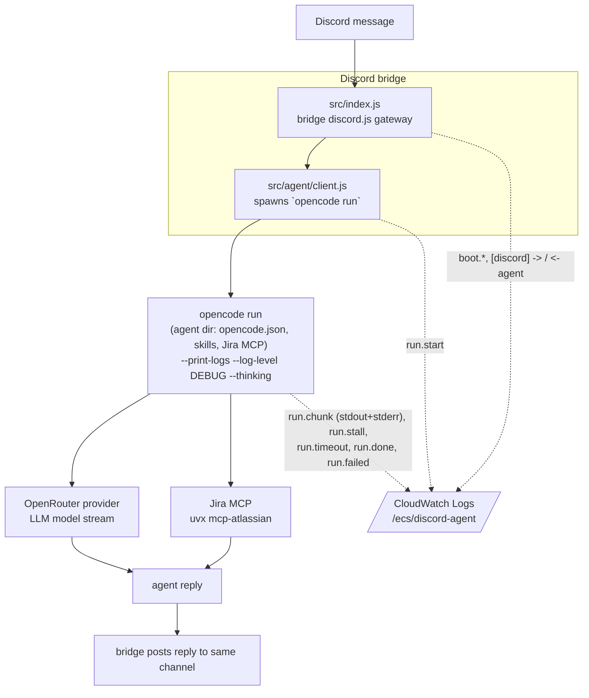
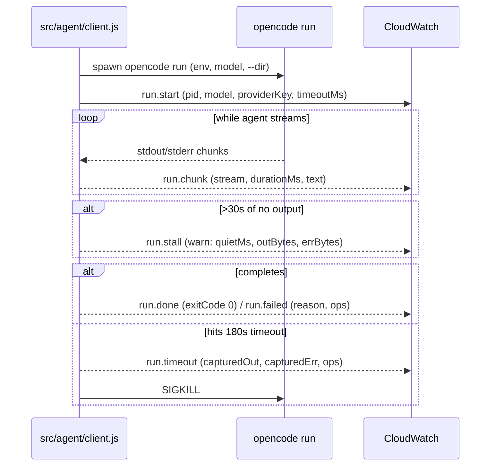

# Log Blueprint — Life OS Discord Agent (AWS ECS Fargate)

A visual map of **where the Discord agent emits logs and how to read them**,
built to diagnose the `run.stall` hang (agent goes quiet ~2min after the model
stream starts) without guessing.

Everything the container prints — the bridge's structured NDJSON logger plus
opencode's debug stream — flushes to **CloudWatch Log group `/ecs/discord-agent`**
(single collection point; there is no per-component log file).

---

## 1. Block diagram (data flow + log emission points)



**Key takeaway:** every component emits into the **same** CloudWatch group, and
`run.chunk` carries opencode's debug stream — so the timestamps of the last
chunk before silence pin down *which* component hangs.

---

## 2. Run lifecycle sequence



---

## 3. Log-source inventory

| Layer | File / emitter | Event names | What it tells you |
|---|---|---|---|
| Bridge boot | `src/index.js` | `boot.health-listening` | Agent + health server started |
| Config render | `scripts/bootstrap.js` | `Wrote agent/opencode.json`, missing-Jira-secret error | Secrets/one-time config rendered |
| Bridge ↔ agent | `src/bridge/client.js` | `[discord] -> agent`, `[discord] <- agent (Nms)`, `[discord] reply posted` | Message round-trip timing at Discord layer |
| Agent run start | `src/agent/client.js` | `run.start` | Spawn preconditions: model, providerKey set?, timeout, pid |
| Agent streaming | `src/agent/client.js` | `run.chunk` | **Leaf evidence** — trace the last chunk before silence to see where it hung (thinking? Jira MCP? after model stream started?) |
| Hang detection | `src/agent/client.js` | `run.stall` (warn) | Went quiet ≥30s; `quietMs`, bytes captured |
| Terminal | `src/agent/client.js` | `run.timeout` / `run.done` / `run.failed` | End state + `capturedOut/capturedErr` + `ops` summary |
| Log format | `src/log.js` | — | One NDJSON line/event (`level`, `event`, `ctx`, `msg`, fields) |

---

## 4. CloudWatch quick path (no SSH needed)

Fetch recent bridge events for the stall window:

```sh
./aws.sh logs tail /ecs/discord-agent --since 10m
```

Filter to just the diagnostic events:

```sh
# the run frames for the last window
./aws.sh logs tail /ecs/discord-agent --since 10m --filter-pattern '"run.chunk"'
./aws.sh logs tail /ecs/discord-agent --since 10m --filter-pattern '"run.stall" OR "run.timeout" OR "run.failed"'
```

Read the `run.chunk` timestamps around `run.stall`: the **last chunk's stream +
text** pinpoints the hanging component (provider vs Jira MCP vs agent loop) —
that is the Phase‑1 root‑cause evidence before changing anything.

---

## 5. SSH / ECS-Exec enablement + connect (fallback for on-box inspection)

> ⚠️ `enableExecuteCommand` is currently **false** on the task def, so exec fails
> today. Enabling requires a one‑time rebuild + redeploy.

1. **Task definition** — set `enableExecuteCommand: true` on the container
   (`/execute:true` or in the task def), e.g. via
   `aws ecs register-task-definition ... --task-role-arn <role>`.

2. **Image** — install the SSM agent so `ecs execute-command` has something to
   talk to on-box:
   ```dockerfile
   RUN apt-get update && apt-get install -y amazon-ssm-agent
   ```

3. **IAM** — grant the task role SSM permissions: `ssm:StartSession`,
   `ssm:SendCommand`, `ssm:TerminateSession`, and the SSM-agent log policy.

4. **Redeploy** (force new deployment to pull the new task def):
   ```sh
   ./aws.sh ecs update-service \
     --cluster discord-agent --service discord-agent \
     --task-definition discord-agent --force-new-deployment
   ```

5. **Get the running task id:**
   ```sh
   ./aws.sh ecs list-tasks --cluster discord-agent
   ```

6. **Open a shell in the container:**
   ```sh
   ./aws.sh ecs execute-command \
     --cluster discord-agent --task <task-id> \
     --container discord-agent --interactive --command "/bin/sh"
   ```

7. **On-box inspection** (what to run once connected):
   ```sh
   ps aux | grep -E 'opencode|node'      # is opencode run actually alive?
   env | grep -E 'OPENROUTER|AGENT_MODEL' # model/provider present?
   cat agent/opencode.json                # rendered config (never baked)
   # manually re-drive a run to reproduce on-box:
   cd agent && opencode run --dir . --print-logs --log-level DEBUG --thinking "what next"
   ```
